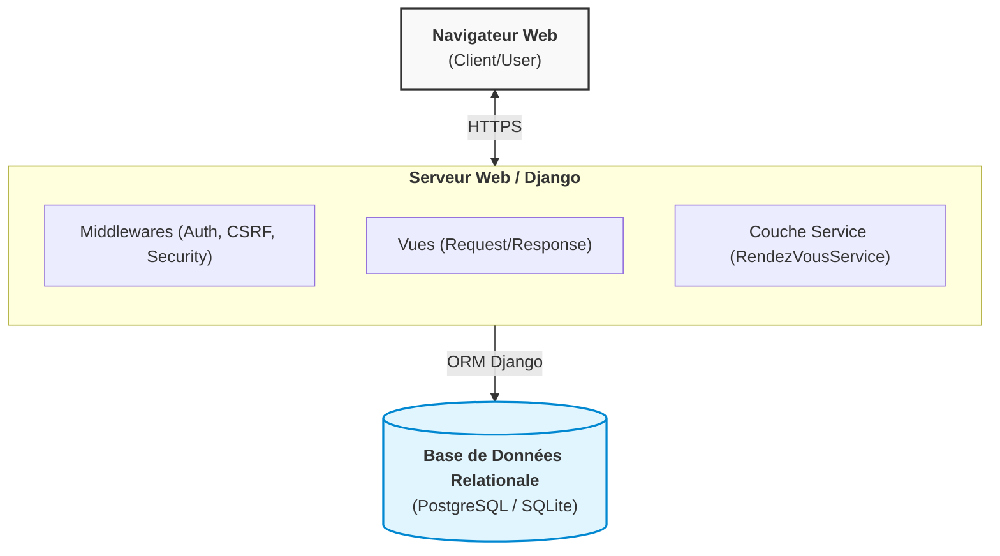

# Dossier SDLC - SunuSanté

## Nom / Groupe : Groupe 1: Mamadou Yassarou Diallo, Aliou Dramé and Nafissatou Niang

## 1. Planification & recueil des besoins

| Contrainte | Réponse |
|---|---|
| **Budget** | Maîtrisé / Académique (Open Source) : priorité au développement backend optimisé et à l'usage de briques éprouvées (Django). |
| **Juridique (RGPD - données de santé)** | Strict respect du traitement des PII (données personnelles) et données médicales : consentement explicite, chiffrement au repos/en transit, droit d'accès et à l'oubli. |
| **Technique (hébergement, BDD, etc.)** | Architecture Python 3.x / Django, base de données PostgreSQL en production, conteneurisation Docker et HTTPS obligatoire. |
| **Qualité & timing** | Approche Agile/Scrum avec livraisons itératives, intégration continue (CI/CD) et couverture de tests unitaires minimum de 80%. |

### Exigences qualité & sécurité posées dès maintenant (Shift Left)

1. **Chiffrement et minimisation des données (Privacy by Design)** : Chiffrement des données sensibles en base de données et transfert sous HTTPS/TLS 1.3.
2. **Gestion stricte des accès et RBAC** : Authentification renforcée pour le personnel médical avec séparation stricte des privilèges (ex: accès `/admin/` limité aux administrateurs).
3. **Analyse statique continue du code (SAST)** : Intégration de linters (`Flake8`, `Black`) et d'outils de détection de vulnérabilités (`Bandit`, `pip-audit`) dès l'étape de développement.

---

## 2. Conception (HLD / LLD)

### HLD - vue générale

### LLD - détails du flux "prendre un rendez-vous"

1. **Requête HTTP POST** : Le navigateur envoie `patient_id`, `date_heure` et `motif` via HTTPS à `/rendezvous/`.
2. **Validation (`RendezVousForm`)** : Django valide le type des données, le jeton CSRF et vérifie l'existence du patient.
3. **Traitement Métier (`RendezVousService`)** : 
   - Appelle `TarifCalculator` pour appliquer les règles métiers (tarif de base, majoration weekend, réduction VIP).
   - Instancie et sauvegarde l'objet `RendezVous` en BDD avec son prix définitif calculé.
4. **Réponse HTTP** : Django renvoie une redirection HTTP 302 vers la facture ou effectue un rendu de la page de confirmation.

---

## 3. Threat Modeling - méthode STRIDE

Flux étudié : **Navigateur → Django (API/vues) → Base de données**

Pour chaque famille de menace STRIDE, identifiez au moins une menace
plausible sur ce flux et une contre-mesure (déjà en place ou à prévoir).

| Menace STRIDE | Exemple concret sur SunuSanté | Contre-mesure |
|---|---|---|
| **S**poofing (usurpation) | | |
| **T**ampering (falsification) | | |
| **R**epudiation (répudiation) | | |
| **I**nformation disclosure (divulgation) | | |
| **D**enial of service (déni de service) | | |
| **E**levation of privilege (élévation de privilège) | | |

## 4. Tableau SSDLC - qualité et sécurité à chaque étape

Pour chaque étape du SDLC, notez l'action concrète que vous appliquez (ou
allez appliquer) dans SunuSanté.

| Étape | Action qualité/sécurité prévue |
|---|---|
| Planification | |
| Design | |
| Codage | |
| Tests | |
| Déploiement | |
